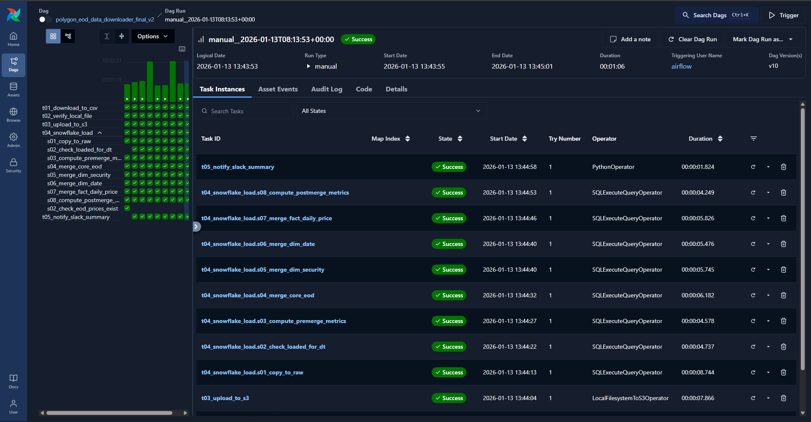
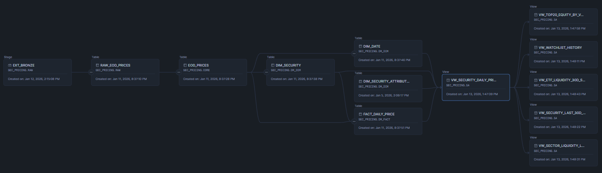
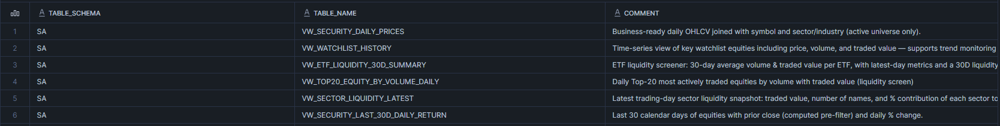
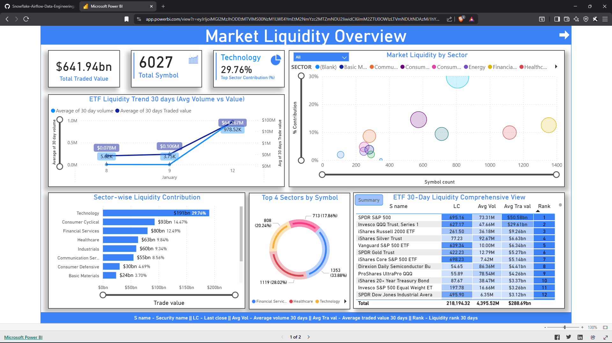
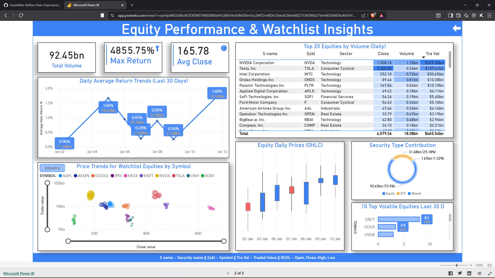

# RBF - EOD Securities Pricing Analytics Platform

## Overview

This project implements a fully automated End-of-Day (EOD) securities pricing analytics platform for a imaginary global investment firm. The solution replaces manual CSV-based reporting with a reliable, scheduled batch data pipeline that delivers business-ready analytics for trading, risk, and research teams.

The platform orchestrates daily ingestion, validation, transformation, and publication of U.S. securities pricing and liquidity data using Apache Airflow and Snowflake, with downstream consumption through Power BI dashboards.

---

## Business Context

RBF financial analysts previously relied on manual data collection and ad-hoc reporting, which delayed insights into market liquidity, sector rotations, ETF performance, and watchlist momentum. This limited the firm’s ability to respond to market movements before the next trading day and introduced operational risk through manual handling.

The objective was to design and deliver an automated, scalable, and auditable batch analytics platform that ensures timely availability of high-quality EOD data every trading day.

---

## What Was Built

### End-to-End Data Pipeline

A modular batch pipeline that ingests EOD market data, standardizes and enriches it, and exposes curated analytical views optimized for BI consumption.

### Orchestration

Apache Airflow (Dockerized) manages:

* Daily ingestion and transformation workflows
* Dependency management across pipeline layers
* Data freshness and validation checks
* Automated Slack notifications on pipeline completion

### Cloud Data Warehouse

Snowflake is used as the central analytics platform with a clear multi-layered design:

* **Warehouse**: `WH_INGEST`
* **Database**: `SEC_PRICING`

#### Schema Design

* **RAW**

  * External Stage: `EXT_BRONZE` (S3-backed)
  * Table: `RAW_EOD_PRICES`

* **CORE**

  * Table: `EOD_PRICES` (cleansed, standardized, deduplicated)

* **DM_DIM**

  * `DIM_DATE`
  * `DIM_SECURITY`
  * `DIM_SECURITY_ATTRIBUTES`

* **DM_FACT**

  * `FACT_DAILY_PRICE`

* **SA (Subject Area)** – BI-ready curated views:

  * `VW_SECURITY_DAILY_PRICES`
  * `VW_WATCHLIST_HISTORY`
  * `VW_ETF_LIQUIDITY_30D_SUMMARY`
  * `VW_TOP20_EQUITY_BY_VOLUME_DAILY`
  * `VW_SECTOR_LIQUIDITY_LATEST`
  * `VW_SECURITY_LAST_30D_DAILY_RETURN`

---

## Pipeline Architecture

The architecture follows a clear separation of concerns between ingestion, storage, transformation, analytics, and visualization.

**High-level flow:**

* Market data sourced from Polygon.io (a.k.a. Massive.com)
* Airflow ingestion DAGs extract and stage data to Amazon S3
* Snowflake external stages and COPY commands load data into RAW
* SQL-based transformations propagate data through CORE, DIM, and FACT layers
* SA views provide business-ready datasets
* Power BI consumes SA views for dashboards
* Slack alerts provide operational visibility

---

## Workflow Orchestration (Airflow)

The Airflow DAG handles:

* API extraction and CSV generation
* Upload to S3
* Snowflake COPY into RAW
* Incremental load validation (date-level checks)
* Dimensional and fact table merges
* Post-merge metrics computation
* Slack notification with run summary

---

## Data Lineage

End-to-end lineage is maintained across RAW → CORE → DIM/FACT → SA, enabling traceability and impact analysis for downstream analytics.

---

## Analytics & Subject Area (SA)

The SA layer exposes curated, analytics-ready datasets designed explicitly for BI users:

* Daily OHLCV metrics enriched with security and sector attributes
* Liquidity screening for equities and ETFs
* Rolling 30-day performance and return analytics
* Sector-level liquidity contribution snapshots
* Watchlist trend and momentum tracking

---

## Power BI Dashboards

The curated Subject Area (SA) views are consumed directly by Microsoft Power BI to deliver interactive, decision-support dashboards for trading, risk, and research teams.

### Dashboard Pages

**Market Liquidity Overview**

* Sector-wise liquidity contribution
* ETF 30-day liquidity trends
* Top sectors by symbol count
* Comprehensive ETF liquidity ranking

**Equity Performance & Watchlist Insights**

* Daily and rolling return trends
* Top equities by traded volume and value
* Watchlist price movements and volatility
* OHLC price behavior and security-type contribution

### Power BI Dashboard Preview

🔗 [**Live Dashboard Preview**](https://app.powerbi.com/view?r=eyJrIjoiMGI2MzJhODEtMTVlMS00NzM1LWE4YmEtM2NmYzc2MTZmNDU2IiwidCI6ImM2ZTU0OWIzLTVmNDUtNDAzMi1hYWU5LWQ0MjQ0ZGM1YjJjNCJ9)

---

## Outcomes & Impact

* Fully automated daily EOD processing with consistent delivery before trading hours
* Significant reduction in manual effort and operational risk
* Faster detection of liquidity shifts and market opportunities
* Improved confidence in trading and risk decisions through standardized analytics
* Scalable architecture that supports future data sources and analytics use cases

---

## Skills & Technologies Applied

**Data Engineering & Architecture**

* Batch data pipeline design
* Dimensional modeling (RAW, CORE, DIM, FACT, SA)
* End-to-end data lineage and validation

**Cloud & Platforms**

* Snowflake (stages, COPY, MERGE, views)
* Amazon S3 integration
* Dockerized Apache Airflow

**Orchestration & Automation**

* Airflow DAG design and dependency management
* Incremental load strategies and delta checks
* Operational alerting with Slack

**Analytics & BI**

* BI-oriented data modeling
* Performance-optimized analytical views
* Power BI integration for business consumption

---

## Acknowledgements

Special thanks to [**Codebasics**](https://codebasics.io/) for the structured guidance and real-world data engineering approach provided as part of their Data Engineering course. This project was built as a direct application of those concepts, with a strong focus on production-grade design, clarity, and business impact.

---

*This project demonstrates a production-style batch analytics platform built with Snowflake and Apache Airflow, focused on reliability, scalability, and business value.*
